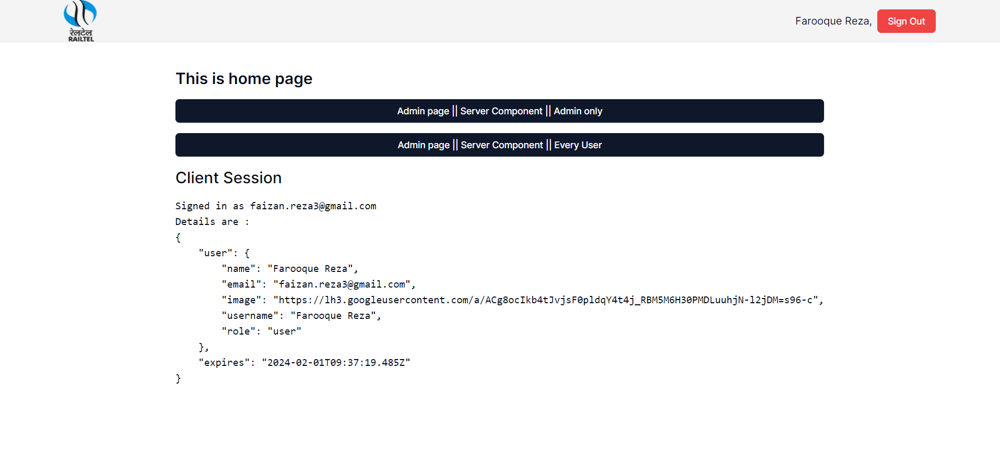
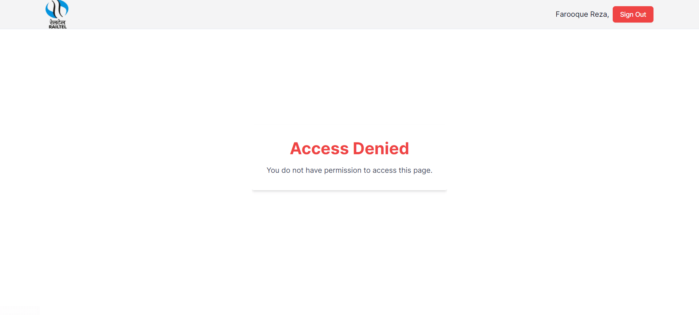
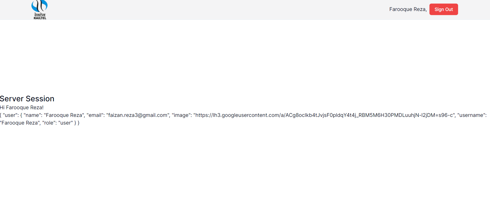

# [NextAuth.js](https://next-auth.js.org/) portal to implement signin, signout, forgot password.

## 🧩 Introduction:

This is a portal for [next authentication](https://next-auth.js.org/). here you will implement all types of authentication methods like signin, signout, forgot password, with username, password and also using 3rd party provider like google, github, etc.

- 👈 use case in server & client components.
- 👈 deeply explore the middleware and learn how to extend next auth session.
- 👈 role based signin and access contents.

## 🪴 Usage

### [open the portals](http://localhost:3000/)

- #### signin page

  - without signin you can not access anything on this portal.
    

- #### home page

  - this is page is client compoennt example
    

- #### access denied page

  -only admin can access this page
  

- #### upload excel sheet with already defined format

- server compoennt example page
  

## Technology Stacks:

- [React](https://react.dev/) - A JavaScript library for building user interfaces
- [Next.js](https://nextjs.org/) - for frontend and backend development.
- [React Hook Form](https://react-hook-form.com/) - for form creation.
- [zod](https://zod.dev/) - for schema validation.
- [prisma](https://prisma.) - is Node.js and TypeScript ORM.
- [tailwindcss](https://tailwindcss.com/) - A utility-first CSS framework.
- [shadcn/ui](https://ui.shadcn.com/) - component library build upon tailwindcss.
- [NextAuth.js](https://next-auth.js.org/) - Authentication for Next.js
- [React Toastify](https://fkhadra.github.io/react-toastify/introduction) - Notification library for React.
- [React icons](https://react-icons.github.io/react-icons/) - icons library for React.

## Folder Structure:

- route in app/
- api in app/api/

## Installation:

```bash
npm install //install all packages
npm run dev //start the project

or

yarn
yarn dev
```
